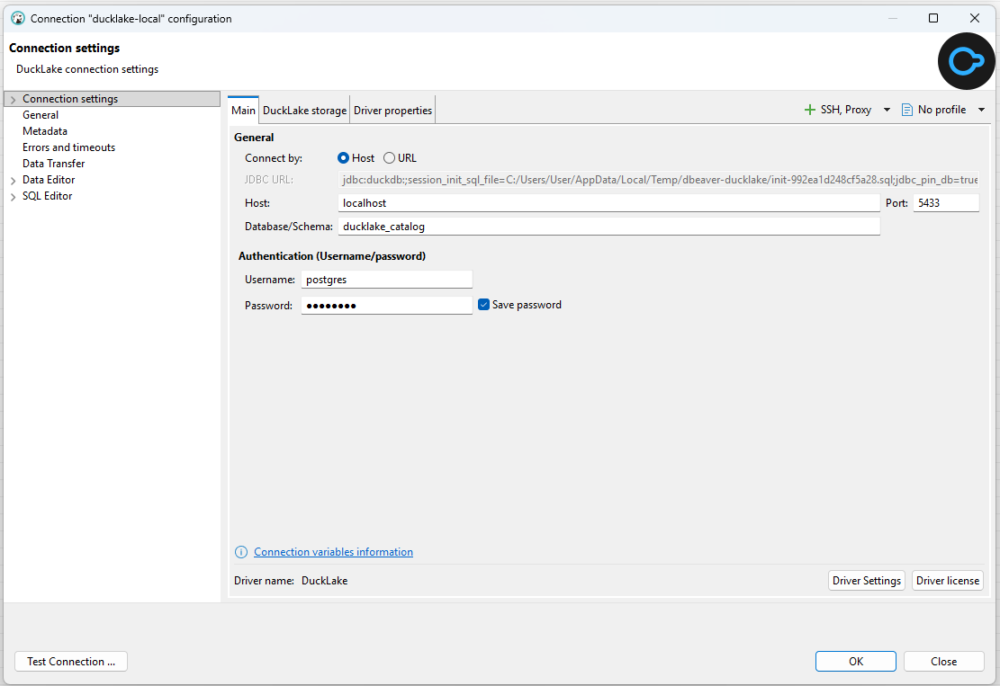
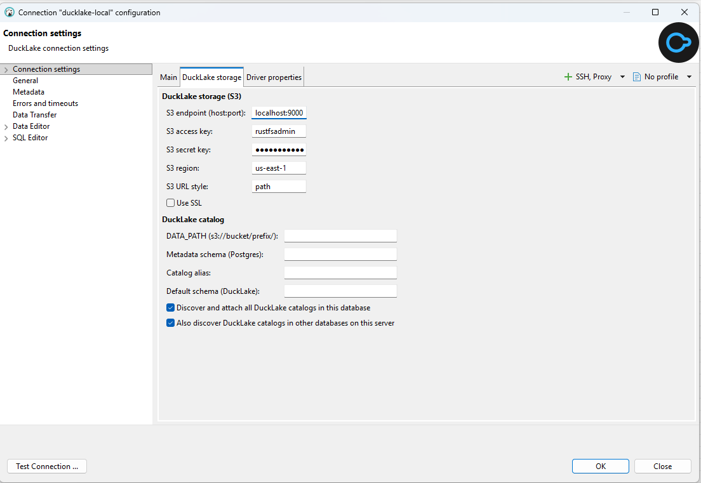
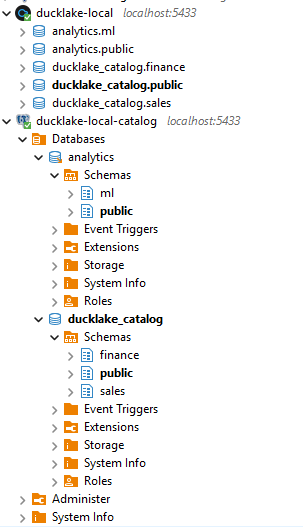

# DuckLake plugin for DBeaver

Adds **DuckLake** (DuckDB's lakehouse format — a SQL catalog + Parquet data on object storage) as a
first-class connection type in [DBeaver](https://dbeaver.io), so you can browse a lake's schemas and
tables in the navigator like any other database.

It's built on top of DBeaver's bundled DuckDB support and adds:

- A dedicated **DuckLake** driver/connection type (with the DuckLake icon).
- A connection page: standard **Host/Port/Database/User/Password** for the **catalog** database
  (Postgres), plus a **DuckLake storage (S3)** tab for the object store.
- **Reliable table browsing** — the plugin re-runs the `ATTACH` on *every* physical connection (SQL
  editor **and** the navigator's metadata connection). This is the fix for the well-known "DuckLake
  tables don't show up in DBeaver" problem.
- **Best-effort attaching** — each catalog is attached on its own, so one your Postgres role cannot
  read is skipped with a warning instead of killing the connection. Leaving the whole **DuckLake
  catalog** group blank is a normal setup, not a broken one.
- A clean tree — DuckDB's internal `memory`/`system`/`temp` databases are hidden, leaving just your
  lake(s).

Works with a local S3 (RustFS/MinIO), real **AWS S3** (leave the key blank to use the credential
chain), or a local-filesystem lake — empty fields are simply omitted from the generated SQL.

## Compatibility

- **DBeaver Community/PRO 26.1.x** (tested against 26.1.1 and 26.1.5). The plugin links against
  DBeaver's internal `org.jkiss.dbeaver.ext.duckdb` and `…ext.generic` APIs, which ship with
  DBeaver — so it needs a DBeaver version with compatible APIs. Other versions may require a rebuild
  (see [Build from source](#build-from-source)).
- Uses the DuckDB JDBC driver **1.5.4.0** (pulled from Maven on first connect). DuckLake v1.0 needs
  DuckDB ≥ 1.5.2.

## Install

1. Download the two jars **and** `install.ps1` (Windows) / `install.sh` (Linux/macOS) from the latest
   [Release](../../releases) into one folder.
2. Run the installer (it copies the jars into DBeaver's `plugins/` and registers them in Equinox
   `bundles.info` — this DBeaver build does **not** load loose `dropins/`):

   **Windows** (DBeaver Community default location):
   ```powershell
   .\install.ps1
   # or:  .\install.ps1 -DBeaverPath "C:\Program Files\DBeaver"
   ```
   **Linux/macOS** (pass the install dir containing `plugins/`):
   ```bash
   ./install.sh /opt/dbeaver
   # macOS: ./install.sh "/Applications/DBeaver.app/Contents/Eclipse"
   ```
3. **Restart DBeaver once with `-clean`** so Equinox rebuilds from `bundles.info`:
   ```
   <dbeaver>/dbeaver -clean
   ```

Uninstall with `uninstall.ps1` / `uninstall.sh` (same arguments), then restart with `-clean`.

## Usage

**Database → New Database Connection → DuckLake.**

The **Main** tab points at the Postgres server that holds the DuckLake metadata. The **DuckLake
storage** tab holds the S3 settings and the catalog options.





| Field | Meaning |
|---|---|
| Host / Port / Database / User / Password | your **DuckLake catalog** (a Postgres database) |
| DuckLake storage (S3) → Endpoint | e.g. `localhost:9000`, or blank for AWS default |
| … Access key / Secret key | S3 credentials (blank key → AWS credential chain) |
| … Region / URL style / Use SSL | `path` style for MinIO/RustFS; SSL on for https endpoints |
| … DATA_PATH | storage location, e.g. `s3://bucket/prefix/`. Leave blank to browse. Setting it is what **creates** a catalog in the Metadata schema when that schema has none. A value that disagrees with an existing catalog's own location is dropped with a warning |
| DuckLake catalog → Metadata schema (Postgres) | the Postgres schema whose catalog you want **active**. Blank tries `public` first, then the other readable catalogs. A schema with no catalog in it is skipped with a warning |
| … Catalog alias | name for whichever catalog ends up active (defaults to `<database>.<schema>`, e.g. `ducklake_catalog.public`) |
| … Default schema (DuckLake) | schema inside the active catalog that unqualified table names resolve to (default `main`) |
| … Discover and attach all DuckLake catalogs in this database | on by default. Attaches every DuckLake catalog in the database, one per Postgres schema. Off attaches only the Metadata schema one |
| … Also discover DuckLake catalogs in other databases on this server | on by default. Attaches the catalogs of every other database you can connect to |

Everything in the **DuckLake catalog** group is optional. Leave all four fields blank and the plugin
attaches every catalog your Postgres role can read, then starts you in the first of them.

Connect, expand the lake → schema → **Tables**, and browse. To change what's hidden, see
**Connection settings → Filters** / the navigator's *Show system objects* toggle.

### Many catalogs, one connection

A DuckLake catalog is a set of `ducklake_*` metadata tables in one Postgres schema. DuckDB's
`METADATA_SCHEMA` option picks that schema and defaults to `public`. So one Postgres server can hold
many catalogs, as several schemas in one database, spread over several databases, or both.

A single DuckLake connection shows all of them:

- Every schema in the database you entered that holds a DuckLake appears as its own top-level node.
- The plugin also probes every other database on the server you have `CONNECT` rights on and adds
  their catalogs too.
- Each one is attached separately. A catalog your role cannot read is skipped with a warning in
  DBeaver's error log, and the rest still show up.

One of them is the **active** catalog, the one new SQL editors start in. The plugin tries the
**Metadata schema (Postgres)** you entered first, or `public` when that field is blank, then the
remaining schemas of your database in alphabetical order, then the other databases. The first one
that attaches wins. So a read-only role that can read `bronze` and `silver` but not `public` ends up
in `bronze`, with a warning about `public`, rather than failing to connect.

Only schemas that already contain a DuckLake are attached. DuckLake's `ATTACH` creates a catalog when
the schema has none, so a typo in **Metadata schema**, or a blank field on a server whose catalogs
live elsewhere, would otherwise leave an empty catalog behind. You get a warning and the next
candidate instead. Filling in **DATA_PATH** is the one way to say you do want a catalog created
there.

Every catalog is named `<database>.<schema>`, e.g. `ducklake_catalog.sales` or `analytics.public`, so
the tree shows where each one lives. **Catalog alias** renames whichever catalog ends up active. The
dot is part of the name, so quote it in SQL: `SELECT * FROM "analytics.public".main.events`.

Here `ducklake-local` is a DuckLake connection to the demo stack below, and `ducklake-local-catalog`
is a plain PostgreSQL connection to the same server with **Show all databases** on. The DuckLake
connection lists one node per catalog. The Postgres connection shows the same five catalogs from the
storage side: each is a schema in `analytics` or `ducklake_catalog` that holds the `ducklake_*`
metadata tables. Bold marks the active catalog, database and schema.



Discovery runs when you connect, so reconnect to see a catalog created later. Untick both discovery
options to mount only the **Metadata schema** catalog. Connecting fails only when not one catalog
could be attached, and the error dialog then lists every reason.

**Default schema (DuckLake)** makes every connection start in that schema of the active catalog. The
plugin runs `USE "<catalog>"."<schema>"` on each connection, so `SELECT * FROM leads` works without a
prefix. If the schema doesn't exist you get a warning and the catalog's own default schema. Picking
another catalog in DBeaver's active catalog selector puts you in that catalog's `main` schema.

## Try it locally (optional demo stack)

`docker/` spins up a complete local DuckLake to test against: **RustFS** (S3) + **Postgres**
(catalog), seeded with five catalogs over two databases.

```bash
cd docker
docker compose up -d      # S3 on :9000 (console :9001), Postgres on host :5433
```

| Postgres database | Metadata schema | Appears in DBeaver as | Tables |
|---|---|---|---|
| `ducklake_catalog` | `public` | `ducklake_catalog.public` | `main.customers`, `main.orders` |
| `ducklake_catalog` | `sales` | `ducklake_catalog.sales` | `main.deals`, `emea.leads` |
| `ducklake_catalog` | `finance` | `ducklake_catalog.finance` | `main.invoices` |
| `analytics` | `public` | `analytics.public` | `main.events` |
| `analytics` | `ml` | `analytics.ml` | `main.features` |

Make a DuckLake connection with Host `localhost`, Port `5433`, Database `ducklake_catalog` and
User/Password `postgres`. On the storage tab set Endpoint `localhost:9000`, key and secret
`rustfsadmin`, URL style `path`, SSL off, and leave the rest blank. All five catalogs show up. To start
SQL editors in the `emea` schema of `ducklake_catalog.sales` instead, set Metadata schema `sales` and
Default schema `emea`.

`quickstart/` shows how to get the same result with the **stock** DuckDB driver (no plugin), for
reference.

## Build from source

Needs JDK 21 and a DBeaver install to compile against (no Maven/Tycho):

```powershell
.\build.ps1          # -> plugin/dist/*.jar
```

Then run `install.ps1` from `plugin/dist` (or copy the jars next to `install.ps1`).

## How it works

- The datasource extends DBeaver's `GenericDataSourceProvider`; `getConnectionURL` writes a
  `session_init_sql_file` (INSTALL/LOAD extensions, then `CREATE SECRET` when the lake is on S3) and
  returns `jdbc:duckdb:;session_init_sql_file=…;jdbc_pin_db=true`. The DuckDB driver runs that file
  on every connection.
- The file holds no `ATTACH` and no `USE` on purpose. A statement that fails there fails the whole
  connection, with nothing able to catch it, and a catalog the Postgres role cannot read is exactly
  the case that must not do that.
- The `ATTACH`es happen from the data source instead, on the first execution context DBeaver opens.
  It asks Postgres through DuckDB's `postgres_query` which schemas contain a `ducklake_metadata`
  table, first in the connection's database and then in each other database, then attaches each
  catalog it finds inside its own try/catch and runs `USE` on the first one that worked. The one
  statement that has to succeed is the read-only Postgres passthrough the probing runs through:
  if that fails, the host or the credentials are wrong.
- Each later connection DBeaver opens (SQL editors run on their own DuckDB instance) replays the
  `ATTACH` statements that worked, one catalog at a time, and the same `USE`. A catalog that has gone
  offline since is skipped with a warning instead of blocking the connection.
- The metadata model extends DBeaver's DuckDB model. It marks `memory`/`system`/`temp` as system
  catalogs (hidden via *Show system objects = off*) and lists a lake's tables via `duckdb_tables()`.

## License

Apache License 2.0 — see [LICENSE](LICENSE) and [NOTICE](NOTICE). Builds on DBeaver's Apache-2.0
code (© DBeaver Corp).
